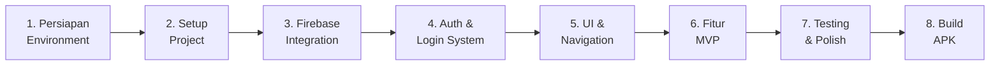
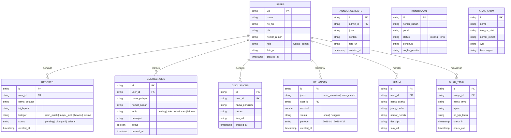
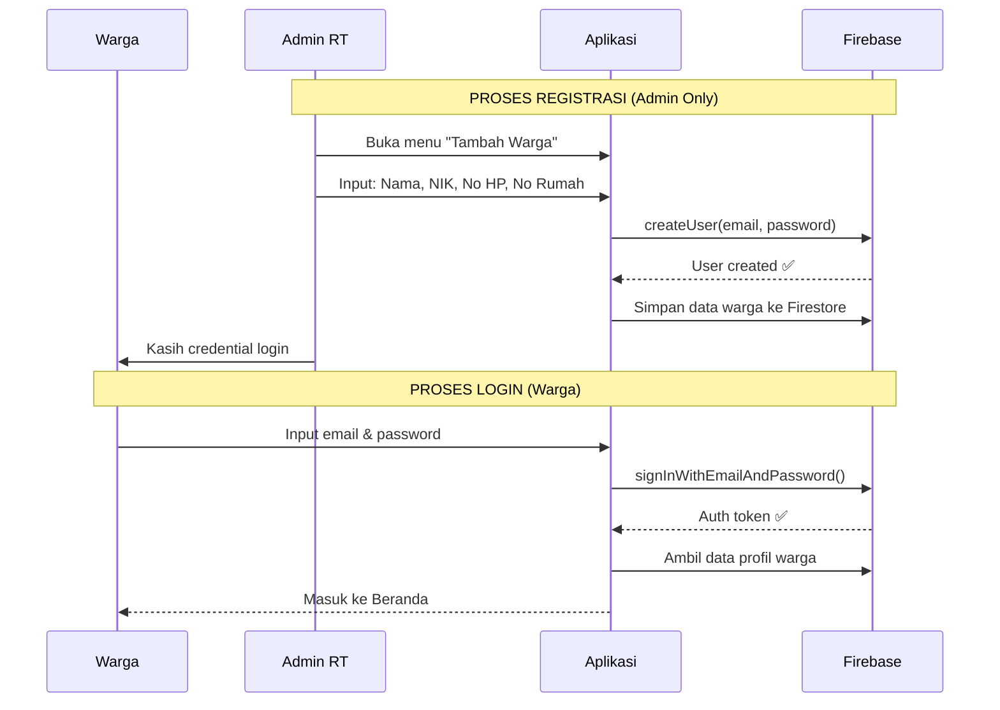
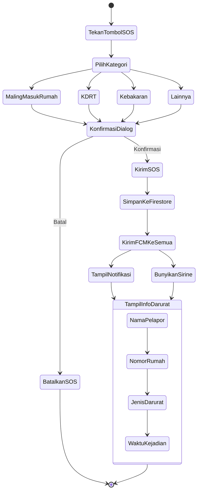
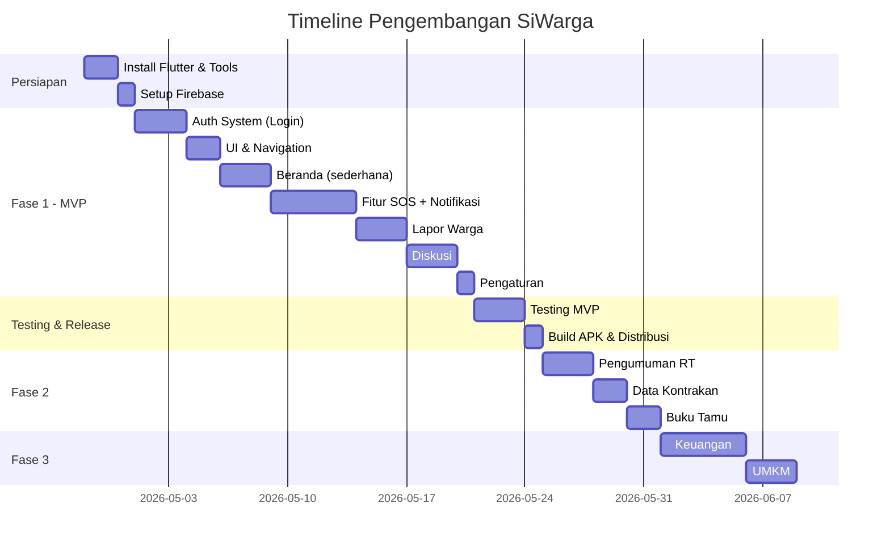

# 📱 Roadmap: SiWarga RT.05 — Dari Nol Sampai APK Siap Install

> **Tujuan**: Membangun aplikasi "Sistem Keamanan & Komunikasi Warga RT" berbasis mobile (APK) dengan fitur SOS darurat, laporan warga, diskusi, dan manajemen RT digital.

---

## 📋 Ringkasan Keputusan Teknologi

| Komponen | Teknologi | Alasan |
|----------|-----------|--------|
| **Frontend (Mobile)** | Flutter | Cross-platform (Android + iOS), satu codebase, performa native |
| **Backend & Database** | Firebase (Firestore) | Realtime database, gratis untuk skala kecil, mudah setup |
| **Authentication** | Firebase Auth | Aman, mendukung phone/email login |
| **Push Notification** | Firebase Cloud Messaging (FCM) | Untuk fitur SOS & pengumuman, gratis |
| **Storage** | Firebase Storage | Untuk foto profil, lampiran laporan |
| **State Management** | Riverpod / Provider | Mudah dipelajari, best practice Flutter |

---

## 🗺️ Overview: 8 Tahap Besar



---

# 🔧 TAHAP 1: Persiapan Environment (Tools yang harus diinstall)

> [!IMPORTANT]
> Ini adalah tahap paling kritis. Kalau environment tidak benar, semua langkah selanjutnya akan gagal.

### Yang harus diinstall di PC kamu:

#### 1.1 Flutter SDK
- **Apa itu?** Framework dari Google untuk bikin app mobile dengan satu bahasa (Dart)
- **Download**: https://docs.flutter.dev/get-started/install/windows/mobile
- **Versi**: Flutter 3.x (stable terbaru)
- **Cara install**:
  1. Download Flutter SDK zip
  2. Extract ke folder (contoh: `C:\flutter`)
  3. Tambahkan `C:\flutter\bin` ke PATH environment variable
  4. Buka terminal, ketik `flutter doctor` untuk cek status

#### 1.2 Android Studio
- **Apa itu?** IDE resmi Android, kita butuh ini untuk Android SDK & Emulator
- **Download**: https://developer.android.com/studio
- **Yang harus diinstall di dalam Android Studio**:
  - Android SDK (otomatis saat install)
  - Android SDK Command-line Tools
  - Android Emulator (untuk testing tanpa HP)
- **Setelah install**, jalankan `flutter doctor` lagi — pastikan semua ✅

#### 1.3 VS Code (sudah ada)
- Install extension: **Flutter** dan **Dart**
- Extension tambahan: **Firebase Explorer** (opsional)

#### 1.4 Git (sudah ada kemungkinan)
- Untuk version control kode kamu

#### 1.5 Firebase CLI
- **Install via npm**: `npm install -g firebase-tools`
- **Login**: `firebase login`

### ✅ Verifikasi Environment
```bash
flutter doctor -v
```
Harus output semua ✅ (centang hijau), terutama:
- Flutter SDK ✅
- Android toolchain ✅  
- Android Studio ✅
- VS Code ✅

---

# 🏗️ TAHAP 2: Setup Project Flutter

### 2.1 Buat Project Baru
```bash
cd e:\DATA\Ngoding\siwarga
flutter create --org com.rt05 siwarga_app
cd siwarga_app
```

> **Penjelasan**:
> - `--org com.rt05` → ini jadi package name app kamu: `com.rt05.siwarga_app`
> - Package name ini penting karena jadi identitas unik app kamu di Play Store nanti

### 2.2 Struktur Folder yang Akan Kita Buat

```
siwarga_app/
├── lib/
│   ├── main.dart                    # Entry point aplikasi
│   ├── app.dart                     # MaterialApp configuration
│   │
│   ├── config/                      # Konfigurasi app
│   │   ├── theme.dart               # Warna, font, styling
│   │   ├── routes.dart              # Navigasi/routing
│   │   └── constants.dart           # Konstanta (nama RT, dll)
│   │
│   ├── models/                      # Data models
│   │   ├── user_model.dart
│   │   ├── report_model.dart
│   │   ├── emergency_model.dart
│   │   ├── discussion_model.dart
│   │   └── announcement_model.dart
│   │
│   ├── services/                    # Logic bisnis & Firebase calls
│   │   ├── auth_service.dart
│   │   ├── database_service.dart
│   │   ├── notification_service.dart
│   │   └── emergency_service.dart
│   │
│   ├── providers/                   # State management
│   │   ├── auth_provider.dart
│   │   ├── report_provider.dart
│   │   └── discussion_provider.dart
│   │
│   ├── screens/                     # Halaman-halaman UI
│   │   ├── auth/
│   │   │   └── login_screen.dart
│   │   ├── home/
│   │   │   ├── home_screen.dart
│   │   │   ├── widgets/
│   │   │   │   ├── citizen_list.dart
│   │   │   │   ├── announcement_feed.dart
│   │   │   │   └── rental_status.dart
│   │   ├── report/
│   │   │   ├── report_screen.dart
│   │   │   └── report_detail.dart
│   │   ├── emergency/
│   │   │   └── emergency_screen.dart
│   │   ├── discussion/
│   │   │   └── discussion_screen.dart
│   │   └── settings/
│   │       └── settings_screen.dart
│   │
│   └── widgets/                     # Reusable widgets
│       ├── bottom_nav.dart
│       ├── custom_button.dart
│       └── loading_indicator.dart
│
├── assets/                          # Gambar, icon, sounds
│   ├── images/
│   ├── icons/
│   └── sounds/
│       └── siren.mp3               # Suara sirine darurat
│
├── android/                         # Android-specific config
├── ios/                             # iOS-specific config (opsional)
├── pubspec.yaml                     # Dependencies
└── firebase.json                    # Firebase config
```

### 2.3 Install Dependencies (pubspec.yaml)

Dependencies yang akan kita butuhkan:

```yaml
dependencies:
  flutter:
    sdk: flutter
    
  # Firebase
  firebase_core: ^3.0.0
  firebase_auth: ^5.0.0
  cloud_firestore: ^5.0.0
  firebase_messaging: ^15.0.0
  firebase_storage: ^12.0.0
  
  # State Management
  flutter_riverpod: ^2.5.0
  
  # UI & UX
  google_fonts: ^6.2.0
  flutter_animate: ^4.5.0
  cached_network_image: ^3.3.0
  
  # Notifications
  flutter_local_notifications: ^17.0.0
  audioplayers: ^6.0.0          # Untuk suara sirine
  
  # Utilities
  intl: ^0.19.0                  # Format tanggal
  image_picker: ^1.0.0           # Upload foto
  shared_preferences: ^2.2.0     # Local storage
  url_launcher: ^6.2.0           # Buka link/telepon
```

> **Penjelasan setiap package**:
> - `firebase_core` → Inisialisasi Firebase di app
> - `firebase_auth` → Sistem login/registrasi
> - `cloud_firestore` → Database realtime (data warga, laporan, dll)
> - `firebase_messaging` → Push notification (untuk SOS & pengumuman)
> - `flutter_riverpod` → Mengelola state app (siapa yang login, data apa yang ditampilkan)
> - `audioplayers` → Memutar suara sirine saat SOS
> - `flutter_local_notifications` → Notifikasi lokal di HP

---

# 🔥 TAHAP 3: Setup & Integrasi Firebase

> [!IMPORTANT]
> Firebase adalah "otak" backend aplikasi kamu. Semua data disimpan di sini.

### 3.1 Buat Firebase Project
1. Buka https://console.firebase.google.com
2. Klik **"Create a project"**
3. Nama project: `siwarga-rt05`
4. Enable Google Analytics (opsional, tapi recommended)

### 3.2 Tambahkan Android App ke Firebase
1. Di Firebase Console, klik **"Add app" → Android**
2. Package name: `com.rt05.siwarga_app`
3. Download file `google-services.json`
4. Taruh file tersebut di `android/app/google-services.json`

### 3.3 Configure via FlutterFire CLI (Cara Modern)
```bash
# Install FlutterFire CLI
dart pub global activate flutterfire_cli

# Generate konfigurasi otomatis
flutterfire configure --project=siwarga-rt05
```

> **Penjelasan**: FlutterFire CLI akan otomatis:
> - Generate file `firebase_options.dart`
> - Update `android/app/build.gradle`
> - Setup semua yang diperlukan

### 3.4 Setup Firestore Database Rules

```javascript
// firestore.rules
rules_version = '2';
service cloud.firestore {
  match /databases/{database}/documents {
    
    // Hanya user yang sudah login bisa baca/tulis
    match /users/{userId} {
      allow read: if request.auth != null;
      allow write: if request.auth.uid == userId || 
                     get(/databases/$(database)/documents/users/$(request.auth.uid)).data.role == 'admin';
    }
    
    // Laporan - semua warga bisa baca, yang login bisa tulis
    match /reports/{reportId} {
      allow read: if request.auth != null;
      allow create: if request.auth != null;
    }
    
    // Emergency - semua warga bisa baca & tulis
    match /emergencies/{emergencyId} {
      allow read, write: if request.auth != null;
    }
    
    // Diskusi - semua warga bisa baca & tulis
    match /discussions/{messageId} {
      allow read, write: if request.auth != null;
    }
    
    // Pengumuman - semua bisa baca, admin bisa tulis
    match /announcements/{announcementId} {
      allow read: if request.auth != null;
      allow write: if get(/databases/$(database)/documents/users/$(request.auth.uid)).data.role == 'admin';
    }
  }
}
```

> **Penjelasan Security Rules**:
> - `request.auth != null` → Hanya user yang sudah login
> - `role == 'admin'` → Hanya RT/admin yang bisa buat pengumuman
> - Ini mencegah orang luar mengakses data warga

### 3.5 Struktur Database (Firestore Collections)



---

# 🔐 TAHAP 4: Sistem Authentication (Login)

> [!NOTE]
> Sistem login kamu unik — **warga tidak bisa register sendiri**. Hanya admin (RT) yang bisa mendaftarkan warga baru.

### 4.1 Alur Login



### 4.2 Implementasi

**Login menggunakan Email + Password** (paling simpel & stabil):
- Email bisa dibuat format: `[nik]@siwarga.rt05` atau email asli warga
- Password default diberikan admin, warga bisa ganti nanti

**Kenapa bukan No HP + OTP?**
- OTP butuh biaya (SMS)
- Firebase free tier terbatas untuk phone auth
- Email auth **100% gratis** dan unlimited

---

# 🎨 TAHAP 5: UI & Navigation

### 5.1 Bottom Navigation Bar

```
┌─────────────────────────────────────────────┐
│                                             │
│              [ KONTEN HALAMAN ]              │
│                                             │
├─────┬──────┬───────┬──────┬─────────────────┤
│  🏠 │  📝  │  🚨   │  💬  │      ⚙️        │
│Beranda│Lapor│ SOS  │Diskusi│  Pengaturan    │
└─────┴──────┴───────┴──────┴─────────────────┘
                  ↑
           Tombol besar merah
           (floating, prominent)
```

### 5.2 Desain Theme

**Color Palette yang akan kita gunakan:**

| Warna | Hex | Fungsi |
|-------|-----|--------|
| Primary Blue | `#1A73E8` | Warna utama app |
| Danger Red | `#DC3545` | Tombol SOS & darurat |
| Success Green | `#28A745` | Status selesai/lunas |
| Warning Orange | `#FFA726` | Status pending |
| Dark Background | `#0F1923` | Mode gelap |
| Card Surface | `#1B2838` | Card background |

---

# 🚀 TAHAP 6: Pengembangan Fitur (Dibagi per Fase)

> [!IMPORTANT]
> Kita TIDAK langsung buat semua fitur. Kita bagi jadi **3 fase** agar aplikasi bisa dipakai secepat mungkin.

## Fase 1 — MVP (Minimum Viable Product) ⏱️ ~2-3 minggu

**Target**: Aplikasi sudah bisa dipakai untuk fungsi inti

| # | Fitur | Prioritas | Deskripsi |
|---|-------|-----------|-----------|
| 1 | Login System | 🔴 Critical | Admin register warga, warga login |
| 2 | Beranda (sederhana) | 🔴 Critical | Profil user + daftar warga |
| 3 | Tombol SOS | 🔴 Critical | Fitur darurat + notifikasi + sirine |
| 4 | Lapor Warga | 🟡 High | Form laporan + daftar laporan |
| 5 | Diskusi | 🟡 High | Chat grup sederhana |
| 6 | Pengaturan | 🟢 Normal | Edit profil, logout |

## Fase 2 — Fitur Tambahan ⏱️ ~2-3 minggu

| # | Fitur | Deskripsi |
|---|-------|-----------|
| 7 | Info RT (Pengumuman) | Feed pengumuman dari admin |
| 8 | Data Kontrakan | Status kontrakan kosong/terisi |
| 9 | Buku Tamu | Lapor tamu digital |
| 10 | Data Anak Yatim | Database anak yatim |

## Fase 3 — Fitur Lanjutan ⏱️ ~2-4 minggu

| # | Fitur | Deskripsi |
|---|-------|-----------|
| 11 | Keuangan | Iuran, infak, tracking pembayaran |
| 12 | UMKM | Daftar usaha warga |
| 13 | Admin Dashboard | Panel khusus RT |
| 14 | Polish & Optimasi | Animasi, performance, UX |

---

## Detail Implementasi Fitur SOS (Core Feature)

> [!CAUTION]
> Fitur ini menyangkut keselamatan warga. Harus diimplementasi dengan sangat hati-hati.

### Alur SOS:



### Mekanisme Notifikasi SOS:
1. **Firebase Cloud Messaging (FCM)** mengirim notifikasi ke SEMUA device
2. Notifikasi menggunakan **high priority** agar muncul meskipun app di background
3. Saat notifikasi diterima, app otomatis memutar **suara sirine**
4. Suara sirine menggunakan package `audioplayers` dengan file `siren.mp3`

---

# 🧪 TAHAP 7: Testing

### 7.1 Testing di Emulator
```bash
flutter run
```

### 7.2 Testing di HP Asli
1. Aktifkan **Developer Mode** di HP Android
2. Aktifkan **USB Debugging**
3. Colokkan HP ke PC via USB
4. Jalankan `flutter devices` untuk cek HP terdeteksi
5. Jalankan `flutter run` — app akan terinstall di HP

### 7.3 Yang Harus Ditest

| Fitur | Test Case |
|-------|-----------|
| Login | Login berhasil, login gagal, password salah |
| SOS | Kirim SOS → semua device dapat notif & sirine |
| Lapor | Buat laporan → muncul di daftar |
| Diskusi | Kirim pesan → muncul realtime |
| Notifikasi | App di background → notif masih muncul |

---

# 📦 TAHAP 8: Build APK & Distribusi

### 8.1 Build APK
```bash
# Build APK release
flutter build apk --release

# Output file akan ada di:
# build/app/outputs/flutter-apk/app-release.apk
```

> **Penjelasan**:
> - `--release` → Build versi final (bukan debug)
> - APK release lebih kecil & lebih cepat dari debug
> - File APK ini yang bisa langsung diinstall di HP warga

### 8.2 Distribusi ke Warga

**Opsi 1: Share langsung (Recommended untuk awal)**
- Kirim file APK via WhatsApp/Telegram ke warga
- Warga install manual (enable "Install from Unknown Sources")

**Opsi 2: Firebase App Distribution**
- Upload APK ke Firebase
- Warga dapat link download
- Bisa track siapa yang sudah install

**Opsi 3: Google Play Store (Masa depan)**
- Butuh akun Google Play Developer ($25 sekali bayar)
- Review process 1-7 hari
- Warga tinggal download dari Play Store

---

# 💰 Estimasi Biaya

| Item | Biaya | Keterangan |
|------|-------|------------|
| Flutter SDK | **Gratis** | Open source |
| Firebase (Spark Plan) | **Gratis** | 50K reads/day, 20K writes/day |
| Hosting Backend | **Gratis** | Firebase menangani semua |
| Domain (opsional) | ~Rp 150K/tahun | Untuk branding |
| Play Store (opsional) | ~Rp 400K sekali | Kalau mau publish |
| **TOTAL MVP** | **Rp 0** | Semua gratis untuk skala RT! |

> [!TIP]
> Firebase Spark Plan (gratis) cukup untuk 200-300 warga. Kalau RT.05 kamu sekitar 50-100 KK, **100% gratis**!

---

# ⏰ Estimasi Timeline



---

# ⚠️ User Review Required

> [!IMPORTANT]
> Sebelum saya mulai coding, tolong konfirmasi beberapa hal berikut:

### Keputusan yang Perlu Kamu Buat:

1. **Login System**: Mau pakai **Email + Password** (gratis, unlimited) atau **No HP + OTP** (butuh biaya SMS)?
   - Rekomendasi: Email + Password, dimana email bisa kita format otomatis dari NIK

2. **Bahasa App**: UI aplikasi full **Bahasa Indonesia** kan?

3. **Tema Warna**: Saya sarankan **dark blue + red accent** untuk kesan keamanan & profesional. Setuju atau mau warna lain?

4. **Suara Sirine**: Untuk fitur SOS, kamu sudah punya file audio sirine? Atau mau saya carikan yang free?

5. **Mulai dari mana?**: Mau langsung mulai dari **Tahap 1 (Install Flutter)** atau kamu sudah punya Flutter terinstall?

6. **MVP atau Full?**: Setuju kita fokus ke **Fase 1 (MVP)** dulu — Login, Beranda, SOS, Lapor, Diskusi — baru fitur lainnya menyusul?

---

# ✅ Langkah Selanjutnya

Setelah kamu approve rencana ini, kita akan mulai:

1. ✅ Cek apakah Flutter sudah terinstall di PC kamu
2. ✅ Buat project Flutter baru di `e:\DATA\Ngoding\siwarga`
3. ✅ Setup Firebase project
4. ✅ Mulai coding Fase 1 (MVP)

---

> **"Perjalanan seribu mil dimulai dari satu langkah pertama."**
> Kita akan bangun aplikasi ini step by step. Setiap langkah akan saya jelaskan secara detail agar kamu bisa belajar sambil membangun. 🚀
